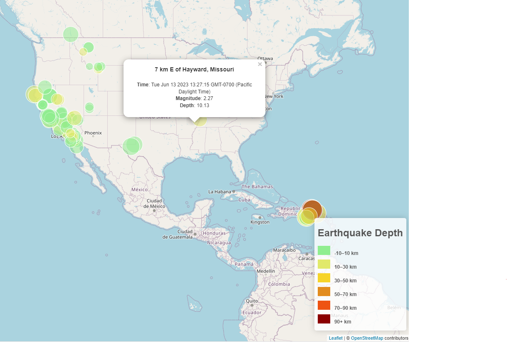

# Earthquake Mapping Challenge

By Grace Yoo

**Programming Languages Used:** Javascript, CSS, HTML

# Description

The United States Geological Survey (USGS) is responsible for providing scientific data about natural hazards, the health of our ecosystems and environment, and the impacts of climate and land-use change. The purpose of this project is to use data from the USGS to build a map of earthquakes occurring in the past 7 days. 

# Steps Taken

1. Pull 7 days earthquake data from the . 
2. Using the Leaflet JS Library, create a map that plots all earthquakes using longitude and latitude. 
3. Vary the marker size and color according the earthquake's size and depth. 
4. Include popups that provide more data when a marker is selected. 

# Results:

